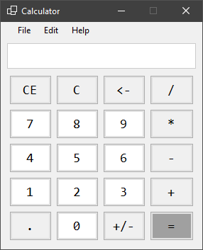

# WinForms Calculator

A simple .NET calculator application made using C# and WinForms.

## Features

- Basic arithmetic operations on two numbers
- Clear, clear entry, and backspace
- Negative values and decimals

Copy and paste available with keyboard shortcuts or menu options.

Numbers consiting of more than 18 total characters are rounded (NOTE: *characters* not *digits*).

*Please note that this is not intended for any serious use.
It is a simple project made for learning purposes and has not been thoroughly tested.*
